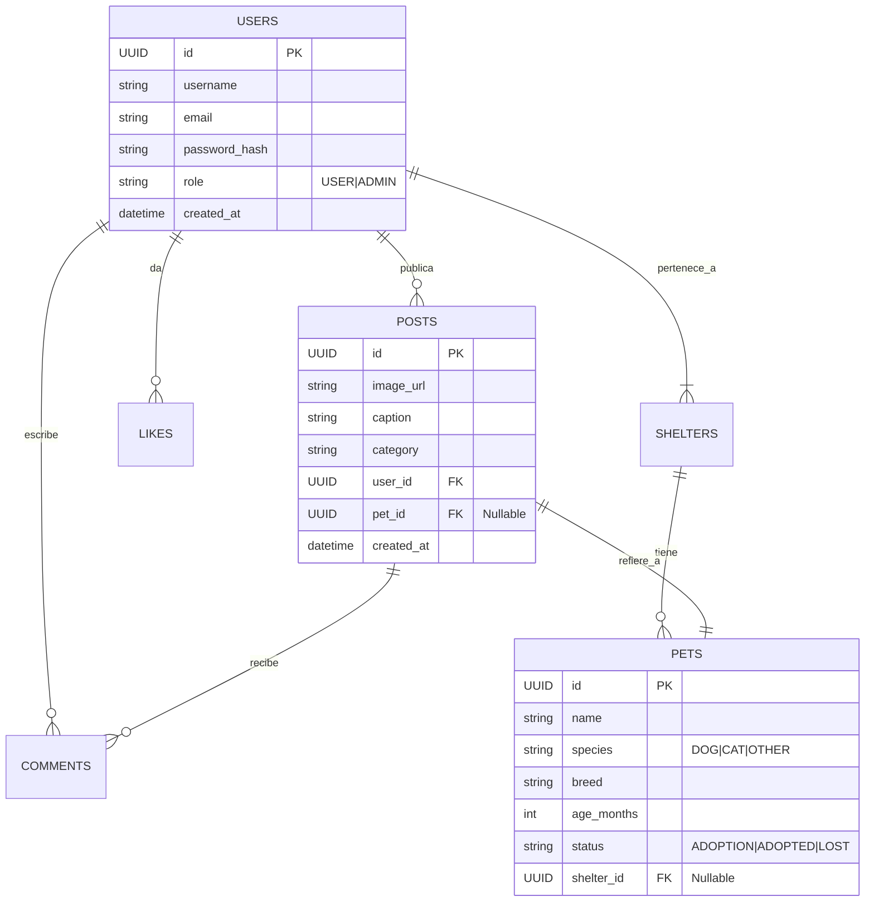

# Modelo de Datos - PetGram

## Diagrama Entidad-Relación (ERD) Simplificado

## Diccionario de Datos (Normalizado)

### 1. Tabla users
Almacena la información de todos los usuarios de la plataforma.
- **PK**: id (UUID)
- **Indices**: email (Unique), username (Composite)

### 2. Tabla pets
Información centralizada de las mascotas. Se separa de los posts para evitar duplicidad si hay múltiples fotos de la misma mascota.
- **PK**: id (UUID)
- **FK**: shelter_id -> shelters(id)

### 3. Tabla posts
Contenido generado por usuarios o refugios (Feed).
- **PK**: id (UUID)
- **FK**: user_id -> users(id)
- **FK**: pet_id -> pets(id) (Opcional, para vincular el post a una ficha técnica)

### 4. Tabla interactions (Likes)
Tabla pivote para relación N:M entre Usuarios y Posts.
- **PK**: (user_id, post_id) (Composite PK)
